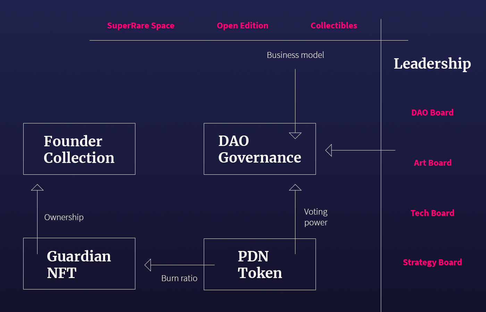

# Architecture

Poseidon DAO is composed by two souls: DAO Governance and Founder Collection. The PDN Token is the glue between them. The token holders have access to DAO Governance using PDN Token. The amount of tokens held defines the voting power in the DAO Governance. The DAO Governance is the core of the DAO, where important decisions are made, managing the DAO Treasury and the business model initiatives. The DAO Governance is led by DAO Boards, that are composed by thematic committees. We will dig into the details of the DAO Governance, in the next section.

Token holders can burn a certain amount of tokens, defined as Burn Ratio, in order to become Guardians. Guardians receive a Guardian NFT, onward named gNFT, that grant them access to the Founder Collection. The Founder Collection is the vault where the whole Poseidon DAO collection is held, at the moment of the DAO launch. The Guardians will be the keepers of the collection. The collection is not meant to be frozen, but the Guardians will run a specific Collection Governance in order to define buy/sell operations over it. The Guardians will be able to grant dividends themselves over the Collection Governance proceedings, that will be reinvested in the collection otherwise. The amount of gNFT held defines the dividends' percentage over the pool of minted NFTs. We will dig into the details of the distribution and governance mechanisms in the following sections.

We decided to split the DAO in two strands. The first reason is we want to maintain higher control over the collection, obviously because of the high investment and effort we put into it. The second reason is we don’t want to limit the scope of the DAO to a decentralized curator focusing on growing our NFT collection. We think this goal would not be inspiring for artists, indeed would be the wrong premise for a community that aims to shape the future of crypto art, explained in the Introduction.

In the following sections, we are going to discuss in details all the concepts introduced in this chapter.
