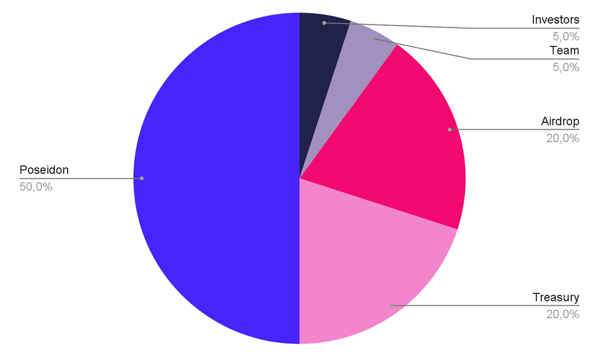
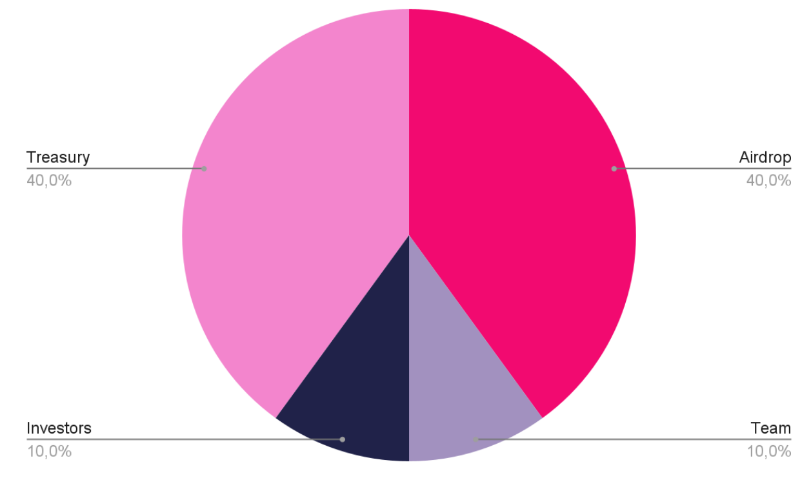

# The PDN Token

The Poseidon Token (PDN) is an ERC20 token that will be released with a supply of 1.000.000.000 PDN. The token will implement the community-driven governance and will act as an incentive for active participation in the DAO. The token is a key factor in the DAO economics, beyond the value of the token itself. Indeed, it both grants voting rights to the token holders and unlocks access to the Founder Collection.

The token will be a liquid asset available for exchange through decentralized pools like Uniswap. The token will also regulate the working relationship for the DAO contributors that will be involved in DAO boards or execute tasks for the DAO.

## Genesis Distribution

The initial token distribution is important for defining the direction of the DAO. A large part of tokens will be reserved to the founder in order to keep high influence over the Founder Collection, burning the largest part of received tokens. A summary of the genesis distribution can be seen in the picture below.

The initial distribution is meant after the initial burn because the deflated amount
will be the actual circulating supply. The after-burn distribution chunks are
described in the following sections.

## Distribution - Pre Burn

## Distribution - Post Burn

### Airdrop - 200.000.000 PDN (40%)

40% of tokens will be reserved for airdrops to incentivize decentralization and, in particular, as an incentive for external potential contributors for participating in the launches that will be part of the business model.

The airdrop tokens will always be available 180 days following the airdrops, which will be distributed at different times based on the different activities. Check the Roadmap chapter for more details about the distributions. In the following sub-sections, the list of pre-allocated chunks for airdrop distributions.

#### SR Artists - 5.000.000 PDN (1%)

Collected SuperRare artists will be the first group receiving PDN in airdrop, as a sign of the high-quality standard we want to set for the DAO.

#### Collectibles - 75.000.000 PDN (15%)

A relevant part of Airdrop distributed PDN tokens will be reserved for the collectibles launch in order to incentivize high participation and reach for our collection.

#### Open Editions - 50.000.000 PDN (10%)

The participants in Open Edition launches will receive PDN tokens in airdrop as well as an incentive to participate and create liquidity for the DAO.

#### Governance - 50.000.000 PDN (10%)

DAO participation and voting will be rewarded and incentivized with periodical airdrops out of this part of the reserve.

#### Reserve - 20.000.000 PDN (4%)

An additional small reserve will be held for extra initiatives and partners that will contribute to the development of the DAO.

### DAO Treasury - 200.000.000 PDN (40%)

A large part of the supply is retained in the DAO Treasury, which will be regulated by the DAO Board. PDN tokens in the DAO Treasury are subject to governance procedures. The whole DAO Treasury vests immediately after the launch.

### Team - 50.000.000 PDN (10%)

The team that will initially compose also the DAO Board will have a small amount
of tokens reserved with a long vesting period.

### Investors - 50.000.000 PDN (10%)

The team will raise the initial funding round to ensure the initial DAO Treasury and decentralized liquidity pools. Investor tokens will be subject to a vesting mechanism, and the PDN tokens will be released incrementally. The initial agreement allows investors to return the PDN in exchange for an equal amount of NFTs from the Founder Collection.
