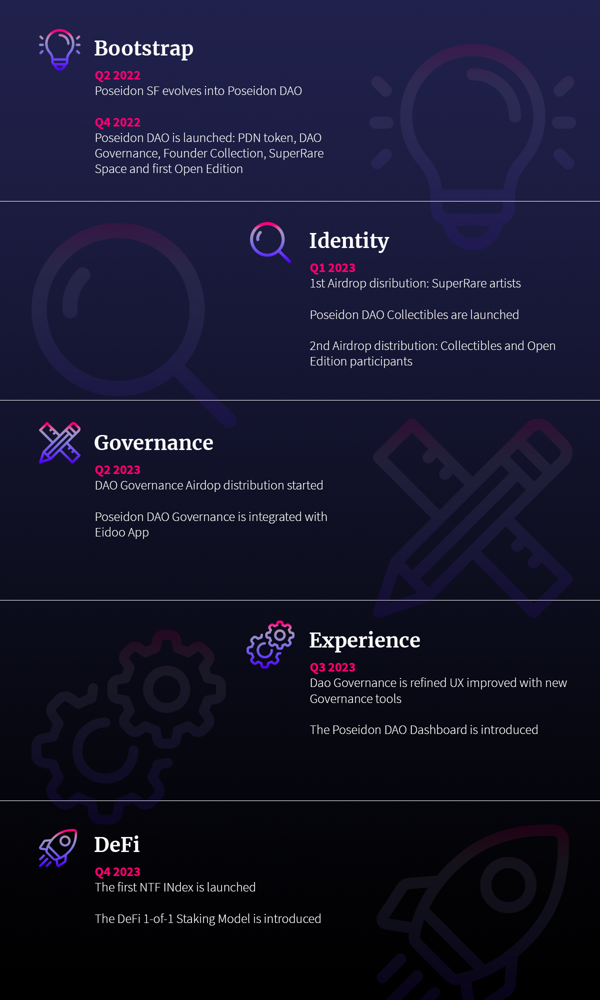

# Roadmap

Around Q2 2022 Poseidon SF evolved into Poseidon DAO and we started designing the Governance and Business model. The DAO is introduced to partners in Q4 2022. The whole launch period is also focused on educational activities to introduce artists and collectors to the vision, DAO model, and UX.

By the end of 2022, the PDN token will be issued on the Ethereum network. At the same time, the DAO Governance model is introduced, as well as the Founder Collection. The launch of the DAO will coincide with the opening of SuperRare Space, as explained in the Business Model. The first Open Edition will be also launched to raise some liquidity for the initial operations.

Soon after the launch of the DAO, the first Airdrop distribution will take place, in favor of SuperRare artists. The rest of the Airdrop will take place after the launch of Poseidon DAO Collectibles, right after the first Airdrop. Participants in the Open Edition and Collectibles will both receive PDN tokens in airdrop.

The remaining tokens destined for airdrop distribution will be later distributed for Governance incentives and other initiatives like new Open Editions or Derivatives. At this point, around Q2 2023, the DAO Governance is integrated with Eidoo app, providing easy access to all participants.

Will follow a period, arguably the entire Q3, mainly focused on the learning process and experience improvements, that will lead to the implementation of new governance tools and integrations. At this point, we also plan to release an analytic Dashboard that will provide data and highlights about collected artists, their growth, and insights about operations targeting both the Founder Collection and investments for the DAO.

In Q4, the DAO will start focusing on innovation by launching the first NFT Index and presenting the research about the first Staking Model for 1-of-1 artworks used as collateral in a decentralized DeFi protocol. The full roadmap is summarized in the picture below.

